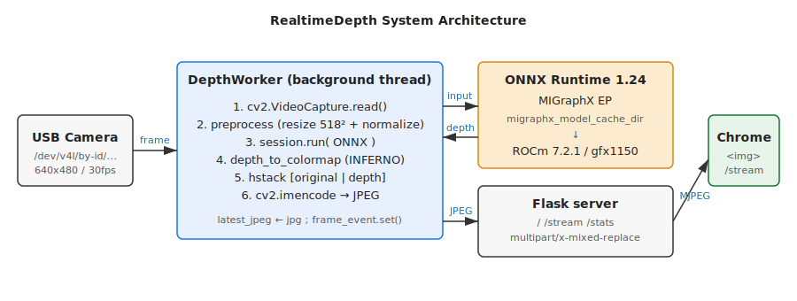
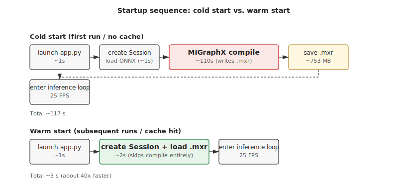
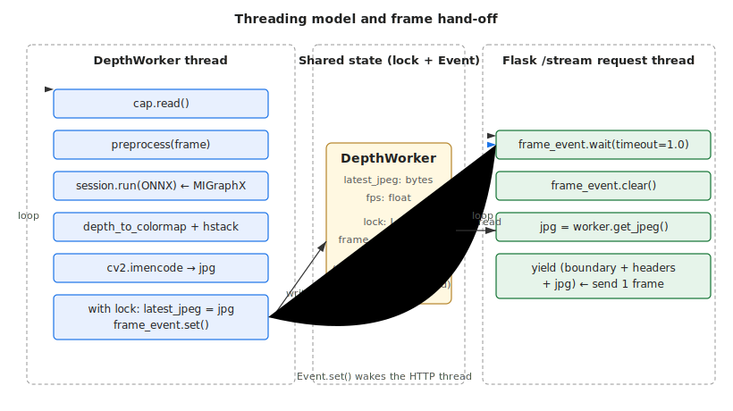

# RealtimeDepth — technical notes

For setup steps, see [README.md](./README.md). This document covers
architecture, design decisions, performance characteristics, and
deeper troubleshooting.

A Japanese version of this document is available as
[TECHNICALJ.md](./TECHNICALJ.md).

---

## 1. System overview



A USB camera produces frames at 30 fps. A single background thread
called `DepthWorker` does the entire pipeline — capture → preprocess →
depth inference → colormap → JPEG encode — and writes only the resulting
`latest_jpeg` to a shared variable. Flask's `/stream` endpoint then
streams those JPEGs to Chrome over `multipart/x-mixed-replace`.

`DepthWorker` also owns **camera connection management**: it is a small
state machine that auto-selects a connected camera from a priority list,
tolerates USB hot-plug (unplug / replug / swap) without crashing, and
serves a placeholder frame while disconnected. See
[§5](#5-threading-model-and-synchronization) for details.

Components:

| Layer | Tech | Role |
| --- | --- | --- |
| Camera I/O | OpenCV (V4L2 backend) | Frame capture |
| Inference | ONNX Runtime 1.24 / MIGraphX EP | Monocular depth estimation |
| GPU runtime | ROCm 7.2.1 (gfx1150) | Kernel execution |
| Model | Depth Anything V2 Small (vits) | ~24.8 M params |
| Streaming | Flask + multipart/x-mixed-replace | MJPEG to the browser |

---

## 2. Why MIGraphX — ONNX Runtime on ROCm 7

**ROCm 7.1 dropped `ROCMExecutionProvider`** and AMD now ships only
`MIGraphXExecutionProvider`. The `onnxruntime-rocm` wheel on PyPI is
built against ROCm 6.x, so on ROCm 7.x it fails to load entirely
(`libhipblas.so.2: cannot open shared object file` — confirm with
`ldd $(...)/libonnxruntime_providers_rocm.so`).

What we use instead:

```
package : onnxruntime-migraphx (cp310 wheel)
source  : https://repo.radeon.com/rocm/manylinux/rocm-rel-7.2.1/
install : pip install -f <URL above> onnxruntime-migraphx
provider: ('MIGraphXExecutionProvider', {'device_id': 0, ...})
```

Note that `pip install` needs `-f` (find-links) rather than
`--index-url`: the AMD page is a plain directory listing, not a
PEP 503 simple index.

---

## 3. The ONNX export trap — `dynamo=False` is required

`torch.onnx.export()` in PyTorch 2.9+ defaults to the new dynamo-based
exporter. It writes opset 18 internally and adds a
`keep_aspect_ratio_policy` attribute on the `Resize` op.

**MIGraphX 1.24.x does not support that attribute** and aborts at run
time:

```
PARSE_RESIZE: keep_aspect_ratio_policy is not supported!
[E:onnxruntime] Failed to call function
```

The fix: explicitly use the legacy (TorchScript-based) exporter.

```python
torch.onnx.export(
    ..., opset_version=17, dynamo=False,
)
```

This emits Resize at opset-17 semantics without the offending attribute,
and MIGraphX parses it cleanly.

---

## 4. The MIGraphX compile cache



MIGraphX performs **AOT compilation** on the first `session.run()`,
generating HIP kernels for gfx1150. For Depth Anything V2 Small at
518² this takes about **110 seconds**. Doing this every restart
destroys the development cycle, so we use the
`migraphx_model_cache_dir` provider option to persist and reuse the
compiled artifact (a `.mxr` file, ~753 MB).

```python
opts = {'device_id': 0,
        'migraphx_model_cache_dir': '/abs/path/.migraphx_cache'}
session = ort.InferenceSession(
    MODEL_PATH,
    providers=[('MIGraphXExecutionProvider', opts), 'CPUExecutionProvider'],
)
```

Measured timings:

| Case | Startup time (app.py launch → /stats responds) |
| --- | --- |
| Cold (no `.mxr`) | ~117 s (~110 s spent in MIGraphX compile) |
| Warm (`.mxr` cache hit) | ~3 s |

The cache key is derived from the ONNX hash, ORT version, and GPU
architecture, so re-exporting the ONNX or upgrading ROCm naturally
invalidates the cache. To force a rebuild manually, just `rm -rf
.migraphx_cache/`.

---

## 5. Threading model and synchronization



### Roles

- **`DepthWorker` thread**: a single loop that grabs a frame, runs
  inference, encodes JPEG, and writes `latest_jpeg`. ~40 ms per
  iteration (25 FPS).
- **Flask /stream request thread**: spawned per client (Chrome).
  Calls `frame_event.wait()` to be notified by the worker, grabs the
  latest JPEG, and writes one multipart part per frame.

### Shared state

```python
self.lock = threading.Lock()
self.frame_event = threading.Event()
self.latest_jpeg = None
self.fps = 0.0
self.current_name = None   # name of the streaming camera (None if disconnected)
```

### Camera connection state machine

The same worker loop also manages the camera lifecycle, so a single
thread owns both inference and connection state (no extra locking
needed). It transitions between two states:

```
[DISCONNECTED] --(registered camera found + opens OK)--> [STREAMING]
[STREAMING]    --(read fails repeatedly or device path gone)--> [DISCONNECTED]
```

- **DISCONNECTED**: every ~1 s it calls `find_connected_camera()`, which
  walks `camera.devices` in priority order, checks the device path
  exists, and verifies it by actually opening it and reading one frame.
  Meanwhile it keeps publishing a "NO CAMERA" placeholder JPEG, so the
  browser's MJPEG connection never drops and recovers the instant a
  camera is plugged in. The app therefore **starts even with no camera
  attached** (no more `RuntimeError`).
- **STREAMING**: normal capture → inference → encode. A single failed
  `cap.read()` is not treated as a disconnect; only a run of
  consecutive failures (`READ_FAIL_LIMIT`, ~10) or the device path
  disappearing (`os.path.exists`) triggers `cap.release()` and a return
  to DISCONNECTED. Both checks are used because `cap.read()` can keep
  blocking on some cameras after the device is yanked.
- **One camera at a time**: selection is first-match in priority order,
  so when several registered cameras are connected only the
  highest-priority one streams. Streaming does **not** preempt — a
  higher-priority camera plugged in mid-stream does not interrupt the
  current feed; unplug the active camera to force a re-select.

Detection is poll-based (path existence + read failures) rather than
event-driven (`pyudev`) to avoid an extra dependency; a 1 s poll is
imperceptible in practice.

We **only keep the most recent frame** — older frames are dropped.
The `Event` ensures HTTP threads only wake up when a new frame is
ready, avoiding busy-loop bandwidth waste.

### Historical bug worth remembering

The first version of `mjpeg_generator` was a busy loop:
`while True: yield latest_jpeg`. It re-sent the same frame on every
iteration of the loop, which on a localhost loopback produced
**9.3 GB of traffic in 3 seconds**. Switching to the
`Event.wait/clear` pattern brought it down to a sane
~1.5 MB/s (≈60 KB × 25 fps).

---

## 6. Pre- and post-processing

### Preprocess (`preprocess`)

Depth Anything V2 (DINOv2 backbone) expects RGB normalized with
ImageNet statistics.

```python
rgb     = cv2.cvtColor(bgr, cv2.COLOR_BGR2RGB)
resized = cv2.resize(rgb, (518, 518), cv2.INTER_CUBIC)
normalized = (resized.astype(np.float32) / 255.0 - MEAN) / STD
return np.transpose(normalized, (2, 0, 1))[None, ...]
# MEAN = [0.485, 0.456, 0.406], STD = [0.229, 0.224, 0.225]
```

### Postprocess (`depth_to_colormap`)

DA V2 outputs a disparity-like map where **closer pixels have larger
values**. We percentile-normalize (2nd / 98th) before applying
`COLORMAP_INFERNO` so the rendering is robust to outliers and
intuitive for the viewer.

- Percentile clamping prevents direct sunlight or specular highlights
  from collapsing the entire frame to black.
- INFERNO (black → purple → orange → yellow) is highly readable and
  matches the "bright = near" intuition.

---

## 7. Configuration reference (`config.yaml`)

```yaml
camera:
  devices:               # priority-ordered; first connected one is used
    - name: 2K USB Camera                 # label for logs / overlay / /stats
      device: <int|str>  # 0 / "/dev/video0" / "/dev/v4l/by-id/usb-...-video-index0"
      width: 640         # optional per device; falls back to defaults
      height: 480
      fps: 30
    - name: Spare Camera
      device: <int|str>
  defaults:              # applied when a device entry omits width/height/fps
    width: 640
    height: 480
    fps: 30

model:
  path: depth_anything_v2_vits_518.onnx
  input_size: 518        # must match what the ONNX was exported with

server:
  host: 0.0.0.0          # use 127.0.0.1 if you don't want LAN exposure
  port: 8000
  jpeg_quality: 80       # 60–90 is the practical range

runtime:
  compile_cache_dir: .migraphx_cache  # set null to disable caching
```

The legacy single-camera form (`camera.device`/`width`/`height`/`fps`
at the top level) is still accepted and normalized internally into a
one-entry `devices` list, so existing configs keep working.

`/stats` returns the selected camera too:
`{"fps": 25.7, "camera": "2K USB Camera"}` (or `"camera": null` while
disconnected).

You can point `app.py` at a different config with the
`CONFIG_PATH=other.yaml` environment variable.

### Registering a new camera

1. With the camera plugged in, find its stable `by-id` path:

   ```bash
   ls -l /dev/v4l/by-id/
   ```

   USB indexes (`/dev/video*`) shift when you replug, so prefer the
   port-independent `by-id` path. The capture stream is the one ending in
   `-video-index0`; `-video-index1` and higher are metadata streams, so
   don't pick those.

2. Add one entry under `camera.devices` in `config.yaml`:

   ```yaml
   camera:
     devices:
       - name: ELECOM 2MP Webcam               # any label for logs / overlay / /stats
         device: /dev/v4l/by-id/usb-Alcor_Micro__Corp._ELECOM_2MP_Webcam-video-index0
   ```

   Omitting `width`/`height`/`fps` falls back to `defaults`. Entries higher
   in the list have priority; when several are connected at once, only the
   first match is streamed.

3. Restart the server to apply:

   ```bash
   ./stop_all.sh && ./start_all.sh
   ```

   On startup, `[camera] connected: <name> (...)` in the log means streaming
   has begun. USB hot-plug is supported, so plugging in after startup is
   auto-detected within ~1 second.

---

## 8. Performance knobs

| Action | Effect |
| --- | --- |
| Lower `INPUT_SIZE` (518 → 392 → 308) | Faster inference (requires re-exporting the ONNX) |
| Lower `JPEG_QUALITY` (80 → 60) | Less LAN bandwidth, slightly less decode work |
| FP16 conversion (`onnxconverter_common.float16`) | Faster inference (requires re-caching) |
| Resize the displayed image with `cv2.resize` | Less encode work |

The dominant cost in this pipeline is **inference at ~30 ms / frame**.
Camera I/O and JPEG encode together stay below 5 ms.

---

## 9. Startup flow (start_all.sh)

```
1. Check .depth_app.pid (refuse double-starts)
2. Activate .venv, export HSA_OVERRIDE_GFX_VERSION=11.5.0
3. Read PORT from config.yaml (yaml.safe_load via the venv's python)
4. nohup python app.py > depth_app.log 2>&1 &
5. Poll /stats every 3 s until it returns HTTP 200, with a 180 s budget
   - Readiness is server-up, not fps > 0, so it succeeds even when no
     camera is connected (the worker serves a placeholder) — Flask only
     starts after the MIGraphX compile, so a 200 already implies compile
     is done
   - Cold runs spend ~110 s of that budget in MIGraphX compile
   - The "ready" line reports the selected camera, or notes that a
     placeholder is being served when none is connected
   - On unexpected exit, tail the log and exit 1
6. Read the LAN IP via `ip route get 1.1.1.1` and print the URL
7. If DISPLAY/WAYLAND_DISPLAY is set, launch google-chrome on that URL
```

`stop_all.sh` is the inverse: send `SIGTERM` from the PID file, wait
10 s, escalate to `SIGKILL` if needed, and finally sweep up any
leftovers via `pgrep -f "python app.py"`.

---

## 10. Troubleshooting (deep dive)

### `ROCMExecutionProvider` is missing
Expected. This project uses MIGraphX. If
`MIGraphXExecutionProvider` shows up in the provider list, you're set.

### MIGraphX fails to load (`libhipblas.so.2: cannot open shared object file`)
PyPI's `onnxruntime-rocm` is most likely installed:
```bash
pip uninstall -y onnxruntime onnxruntime-rocm
pip install -f https://repo.radeon.com/rocm/manylinux/rocm-rel-7.2.1/ onnxruntime-migraphx
```

### `PARSE_RESIZE: keep_aspect_ratio_policy is not supported`
The ONNX was exported with the new dynamo exporter. Re-export with
`dynamo=False` and `opset_version=17` (see
[§3](#3-the-onnx-export-trap--dynamofalse-is-required)).

### Compile runs every time
- Make sure `runtime.compile_cache_dir` in `config.yaml` is not
  commented out
- Verify the directory is writable: `ls -ld .migraphx_cache`
- Right after re-exporting the ONNX, the first run will compile once
  more (that's expected — a fresh cache is created)

### GPU isn't being used / inference is CPU-slow
- Check `session.get_providers()[0]` is `MIGraphXExecutionProvider`
- Confirm `HSA_OVERRIDE_GFX_VERSION=11.5.0` is set (start_all.sh sets
  it automatically)
- Run `rocm-smi` in another terminal and watch GPU utilization rise

### Chrome stalls
- Open DevTools → Network and verify `/stream` is `pending` and
  receiving bytes
- A reload (Cmd/Ctrl+R) usually recovers
- Avoid opening multiple tabs — each tab consumes its share of the
  worker bandwidth

### Camera stops working after a port change
`/dev/video*` indexes shift around. Use `/dev/v4l/by-id/...` paths for
the `camera.devices` entries so the same camera is found regardless of
port. With a `by-id` path the worker also reconnects automatically after
an unplug/replug; with bare integer indexes a re-plug may grab a
different camera.

### Stuck on the "NO CAMERA" placeholder
No registered camera is currently connected. Check that a path listed
under `camera.devices` exists (`ls /dev/v4l/by-id/`) and that no other
process holds the device. The app polls every ~1 s and switches to the
live feed as soon as a registered camera appears — no restart needed.

---

## 11. Future extensions

- **Absolute depth**: switching to Depth Anything V2 Metric Depth
  (Hypersim variant) yields metric values; you can render
  "2.3 m" directly in the HUD.
- **Proximity alert**: count pixels closer than a threshold and flash
  a red border when too many fall inside.
- **WebSocket transport**: MJPEG → WS + binary frames if you want to
  shave more end-to-end latency.
- **HTTPS for remote access**: Tailscale + Caddy is the quickest path
  to TLS for off-LAN viewing.
- **FP16 model**: convert with `onnxconverter_common.float16` to halve
  weight memory traffic; expect ~1.3–1.5x speedup on gfx1150.

---

## 12. Repository layout

```
RealtimeDepth/
├── app.py                  # Flask + DepthWorker (main)
├── test_inference.py       # Standalone inference benchmark (~30 ms/frame)
├── config.yaml             # Runtime configuration
├── start_all.sh            # Start script (auto-launches Chrome)
├── stop_all.sh             # Stop script
├── README.md / READMEJ.md  # Setup guide (English / Japanese)
├── TECHNICAL.md / TECHNICALJ.md  # This document (English / Japanese)
├── docs/
│   ├── architecture-en.svg / architecture.svg
│   ├── threading-en.svg    / threading.svg
│   └── startup_sequence-en.svg / startup_sequence.svg
├── Depth-Anything-V2 -> ~/Depth-Anything-V2  (symlink)
├── depth_anything_v2_vits_518.onnx           (gitignored)
├── .migraphx_cache/                          (gitignored)
├── .depth_app.pid                            (gitignored)
└── depth_app.log                             (gitignored)
```

---

## 13. Changelog

- **Multi-camera / USB hot-plug support**: introduced the priority-ordered
  `camera.devices` list and automatic reconnection. The legacy single-camera
  form is still accepted for backward compatibility.
- **Registered connected camera**: added the ELECOM 2MP Webcam by its stable
  `by-id` path. See §7 for the procedure to add a new camera.
- **Startup message fix**: fixed the false "no camera connected" message caused
  by the few-hundred-ms gap between `/stats` responding and the DepthWorker
  opening the camera. `start_all.sh` now waits a few seconds for the camera
  name to settle before deciding.
