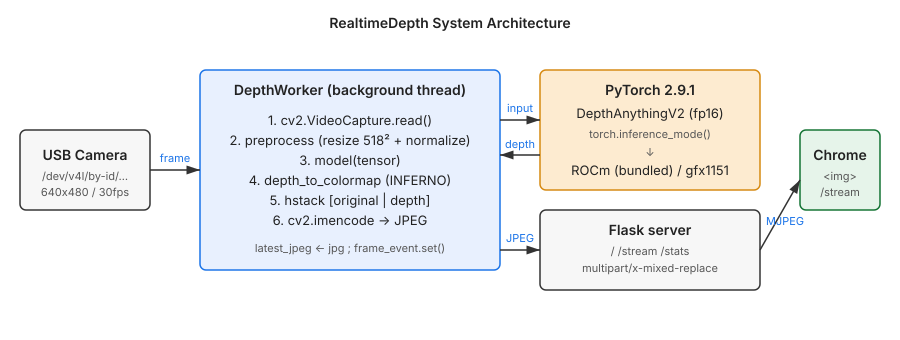
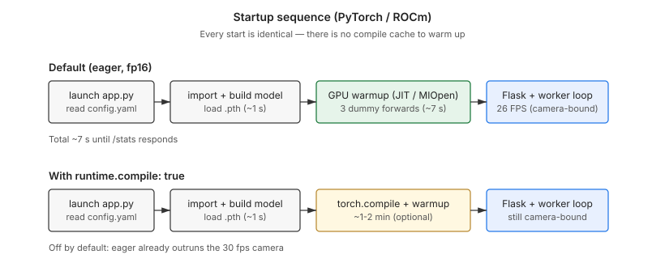
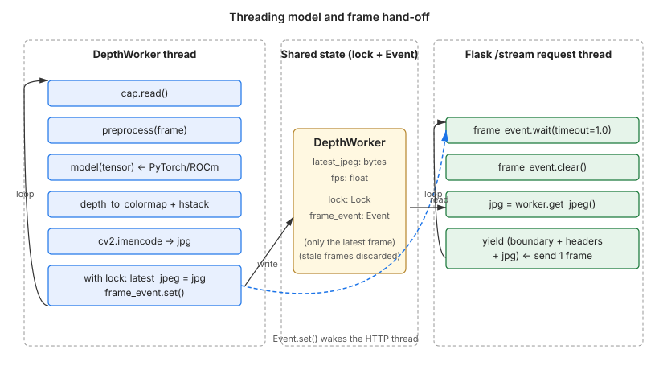

# RealtimeDepth — technical notes

For setup steps, see [README.md](./README.md). This document covers
architecture, design decisions, performance characteristics, and
deeper troubleshooting.

A Japanese version of this document is available as
[TECHNICALJ.md](./TECHNICALJ.md).

---

## 1. System overview



A USB camera produces frames at 30 fps. A single background thread
called `DepthWorker` does the entire pipeline — capture → preprocess →
depth inference → colormap → JPEG encode — and writes only the resulting
`latest_jpeg` to a shared variable. Flask's `/stream` endpoint then
streams those JPEGs to Chrome over `multipart/x-mixed-replace`.

`DepthWorker` also owns **camera connection management**: it is a small
state machine that auto-selects a connected camera from a priority list,
tolerates USB hot-plug (unplug / replug / swap) without crashing, and
serves a placeholder frame while disconnected. See
[§5](#5-threading-model-and-synchronization) for details.

Components:

| Layer | Tech | Role |
| --- | --- | --- |
| Camera I/O | OpenCV (V4L2 backend) | Frame capture |
| Inference | PyTorch 2.9.1 (ROCm 7.13 wheel) | Monocular depth estimation |
| GPU runtime | Bundled with the wheel (`rocm-sdk-libraries-gfx1151`) | Kernel execution |
| Model | Depth Anything V2 Small (vits) | ~24.8 M params |
| Streaming | Flask + multipart/x-mixed-replace | MJPEG to the browser |

---

## 2. Why native PyTorch — migrating off ONNX/MIGraphX (2026-07)

This project originally ran inference through ONNX Runtime with the
MIGraphX execution provider. That path has been dropped in favour of
native PyTorch inference.

### What forced the move

Upgrading to Ubuntu 26.04 / ROCm 7.14 broke GPU inference beyond repair.

1. **exec-stack**: the venv's `onnxruntime_pybind11_state.so` requests
   `GNU_STACK=RWE` (an executable stack), which the 26.04 kernel refuses
   at import time. Clearing the ELF `PF_X` bit works around it, but that
   only buys back CPU execution.
2. **No MIGraphX exists**: AMD ships no MIGraphX for gfx1151 on ROCm 7.14
   through any channel (`whl/gfx1151`, nightlies, and
   `packages-multi-arch` were all checked). The one obtainable build — a
   generic 7.2.1 deb — links fine against 7.14 libraries by soname, but
   **its run-time JIT of GPU kernels fails under the 7.14 clang/HIP
   headers** (ambiguous `__hmax`, `-Werror` on LLVM23's
   `[[clang::lifetimebound]]`, and finally `std::bad_alloc`). This is a
   genuine source-level incompatibility, not something `-Wno-error` fixes.

The lesson: MIGraphX **JITs GPU kernels at run time using the system's
comgr/clang**, so the migraphx version and the ROCm toolchain version must
match. Matching link-time ABI is not sufficient.

### Why PyTorch

- **DA V2 is a pure PyTorch model to begin with** (DINOv2 + DPT head).
  The ONNX layer was pure overhead, and dropping it also retires traps
  like the Resize-op incompatibility we used to work around.
- **Structural decoupling from the system ROCm.** PyTorch's ROCm wheels
  pull in `rocm-sdk-libraries-gfx1151` and **bundle their own ROCm
  runtime**. The only thing that has to work is the kernel driver
  (KFD/amdgpu — in-tree and recent enough on 26.04). The whole "ROCm 7.14
  has no MIGraphX" problem existed only because onnxruntime-migraphx was
  tightly coupled to the system ROCm install.
- **It's faster.** Measured at nearly 8× the ONNX Runtime CPU fallback
  (~10 FPS). See [§8](#8-performance).

### Leftovers from the old path

All of them have been removed (2026-07): `.venv` (Python 3.10 +
onnxruntime-migraphx, CPU-only), `depth_anything_v2_vits_518.onnx`, and
the `.migraphx_cache/` `.mxr` artifact — about 2.2 GB in total. Nothing in
the current code referenced them.

The MIGraphX source build is still frozen on disk outside this repo, with
its dependency build complete (`~/AMDMIGraphX`; see `PROGRESS.md`). With
inference at 77 FPS there is no reason to go back. Should you ever need
the ONNX again, re-export it from the `.pth` checkpoint.

---

## 3. Wheel-sourcing pitfalls

Nearly every failure on the PyTorch path is one of these three.

### 3-1. Use the gfx1151-specific index

```
https://repo.amd.com/rocm/whl/gfx1151/     ← this one
https://download.pytorch.org/whl/rocm...   ← not this one
```

pytorch.org's ROCm wheels are multi-arch kpack builds. On gfx1151 the
bundled code object cannot be loaded and the process dies at run time:

```
hipErrorInvalidImage
kpack_load_code_object failed with error: 13
```

See [README.md §3](./README.md) for the install commands.

### 3-2. Pin torch and torchvision as a matched pair

The index lists torchvision 0.24.0 / 0.25.0 / 0.26.0 side by side, so
omitting the version resolves to the newest one and desynchronizes it
from torch. The result is an import-time failure:

```
RuntimeError: operator torchvision::nms does not exist
```

torchvision's C++ extension was built against a different libtorch, so
its custom-op registration never completes before `register_fake` runs.

| torch | torchvision |
| --- | --- |
| 2.9.1 | 0.24.0 |
| 2.10.0 | 0.25.0 |
| 2.11.0 | 0.26.0 |

torchvision is not optional: `depth_anything_v2/dpt.py` does
`from torchvision.transforms import Compose` (only the official
`infer_image()` path actually uses it, but the import runs unconditionally).

### 3-3. Do not set `HSA_OVERRIDE_GFX_VERSION`

Wheels from `repo.amd.com/rocm/whl/gfx1151/` are native gfx1151 builds.
Masquerading as gfx1100 is not merely unnecessary but harmful, so
`start_all.sh` explicitly `unset`s it in case a shell profile exports it.

> The old MIGraphX path *required* `HSA_OVERRIDE_GFX_VERSION=11.5.1`.
> Copying that line out of an old runbook will break this setup.

### 3-4. Python version

gfx1151 wheels exist only for **cp312 / cp313 / cp314**. The old `.venv`
runs Python 3.10 (chosen to match the onnxruntime-migraphx cp310 wheel),
so it cannot be reused — hence the separate `.venv-torch`.

---

## 4. Model loading and warmup



At startup `app.py` puts the official repo on `sys.path`, imports the
`depth_anything_v2` package, builds the model with the DPT head
configuration for the chosen encoder, and loads the `.pth`.

```python
sys.path.insert(0, DAV2_REPO)            # config's model.repo (a symlink)
from depth_anything_v2.dpt import DepthAnythingV2

ENCODER_CONFIGS = {                      # identical to the official app.py's model_configs
    'vits': {'features': 64,  'out_channels': [48, 96, 192, 384]},
    'vitb': {'features': 128, 'out_channels': [96, 192, 384, 768]},
    'vitl': {'features': 256, 'out_channels': [256, 512, 1024, 1024]},
    'vitg': {'features': 384, 'out_channels': [1536, 1536, 1536, 1536]},
}
model = DepthAnythingV2(encoder=ENCODER, **ENCODER_CONFIGS[ENCODER])
model.load_state_dict(torch.load(CHECKPOINT, map_location='cpu'))
model = model.to(device=DEVICE, dtype=DTYPE).eval()
```

`input_size` must be a **multiple of 14**, because the DPT head splits
the input into 14×14 patches. The default 518 is `14 × 37`. Invalid
values are rejected with a `ValueError` at startup.

### Warmup

The first `forward()` pays for HIP kernel JIT, MIOpen convolution
algorithm selection, and allocator pool setup all at once — several
seconds. Doing that **before** Flask starts keeps the first few frames
from showing an absurdly low FPS.

```python
def warmup():
    dummy = np.zeros((INPUT_SIZE, INPUT_SIZE, 3), dtype=np.uint8)
    for _ in range(3):
        infer(dummy)
    torch.cuda.synchronize()
```

| Case | Startup time (app.py launch → /stats responds) |
| --- | --- |
| Default (eager, fp16) | ~7 s (nearly all of it warmup) |
| `runtime.compile: true` | 1–2 min (torch.compile) |

The old MIGraphX path's ~110 s AOT compile and 753 MB `.mxr` cache are
gone; `.migraphx_cache/` has been deleted.

### torch.compile

`runtime.compile: true` wraps the model in
`torch.compile(model, mode="reduce-overhead")`. It ships off: fp16 eager
already delivers 77 FPS and the bottleneck is the camera's 30 fps, so
paying 1–2 minutes on every start buys nothing. It stays available for
when you move to a larger encoder or a higher resolution.

---

## 5. Threading model and synchronization



### Roles

- **`DepthWorker` thread**: a single loop that grabs a frame, runs
  inference, encodes JPEG, and writes `latest_jpeg`. ~38 ms per
  iteration (26 FPS). Inference itself is only ~13 ms, so the loop is
  paced by the camera's 30 fps.
- **Flask /stream request thread**: spawned per client (Chrome).
  Calls `frame_event.wait()` to be notified by the worker, grabs the
  latest JPEG, and writes one multipart part per frame.

### Shared state

```python
self.lock = threading.Lock()
self.frame_event = threading.Event()
self.latest_jpeg = None
self.fps = 0.0
self.current_name = None   # name of the streaming camera (None if disconnected)
```

### Camera connection state machine

The same worker loop also manages the camera lifecycle, so a single
thread owns both inference and connection state (no extra locking
needed). It transitions between two states:

```
[DISCONNECTED] --(registered camera found + opens OK)--> [STREAMING]
[STREAMING]    --(read fails repeatedly or device path gone)--> [DISCONNECTED]
```

- **DISCONNECTED**: every ~1 s it calls `find_connected_camera()`, which
  walks `camera.devices` in priority order, checks the device path
  exists, and verifies it by actually opening it and reading one frame.
  Meanwhile it keeps publishing a "NO CAMERA" placeholder JPEG, so the
  browser's MJPEG connection never drops and recovers the instant a
  camera is plugged in. The app therefore **starts even with no camera
  attached** (no more `RuntimeError`).
- **STREAMING**: normal capture → inference → encode. A single failed
  `cap.read()` is not treated as a disconnect; only a run of
  consecutive failures (`READ_FAIL_LIMIT`, ~10) or the device path
  disappearing (`os.path.exists`) triggers `cap.release()` and a return
  to DISCONNECTED. Both checks are used because `cap.read()` can keep
  blocking on some cameras after the device is yanked.
- **One camera at a time**: selection is first-match in priority order,
  so when several registered cameras are connected only the
  highest-priority one streams. Streaming does **not** preempt — a
  higher-priority camera plugged in mid-stream does not interrupt the
  current feed; unplug the active camera to force a re-select.

Detection is poll-based (path existence + read failures) rather than
event-driven (`pyudev`) to avoid an extra dependency; a 1 s poll is
imperceptible in practice.

We **only keep the most recent frame** — older frames are dropped.
The `Event` ensures HTTP threads only wake up when a new frame is
ready, avoiding busy-loop bandwidth waste.

### Historical bug worth remembering

The first version of `mjpeg_generator` was a busy loop:
`while True: yield latest_jpeg`. It re-sent the same frame on every
iteration of the loop, which on a localhost loopback produced
**9.3 GB of traffic in 3 seconds**. Switching to the
`Event.wait/clear` pattern brought it down to a sane
~1.5 MB/s (≈60 KB × 25 fps).

---

## 6. Pre- and post-processing

### Preprocess (`preprocess`)

Depth Anything V2 (DINOv2 backbone) expects RGB normalized with
ImageNet statistics. Resizing happens on the CPU (OpenCV), but
**normalization runs on the GPU**.

```python
rgb     = cv2.cvtColor(bgr, cv2.COLOR_BGR2RGB)
resized = cv2.resize(rgb, (518, 518), interpolation=cv2.INTER_CUBIC)
t = torch.from_numpy(np.ascontiguousarray(resized)).to(DEVICE)   # transfer as uint8 HWC
t = t.permute(2, 0, 1).unsqueeze(0).to(DTYPE).div_(255.0)        # CHW + fp16 on the GPU
return (t - MEAN) / STD
# MEAN = [0.485, 0.456, 0.406], STD = [0.229, 0.224, 0.225] (fp16, shape (1,3,1,1))
```

Expanding to float32 on the CPU first would mean transferring
518×518×3×4 ≈ 3.2 MB per frame; sending uint8 is a quarter of that
(~0.8 MB). The normalization itself is effectively free on the GPU.

### Inference (`infer`)

```python
@torch.inference_mode()
def infer(bgr):
    depth = model(preprocess(bgr))   # forward returns (B, H, W)
    return depth[0].float().cpu().numpy()
```

`DepthAnythingV2.forward()` ends with `squeeze(1)`, so the output has no
channel dimension — `(B, H, W)`, the same tensor the ONNX path reached
via `out[0][0]`. Since inference runs in fp16, we `.float()` before
handing it to `depth_to_colormap`.

### Postprocess (`depth_to_colormap`)

DA V2 outputs a disparity-like map where **closer pixels have larger
values**. We percentile-normalize (2nd / 98th) before applying
`COLORMAP_INFERNO` so the rendering is robust to outliers and
intuitive for the viewer.

- Percentile clamping prevents direct sunlight or specular highlights
  from collapsing the entire frame to black.
- INFERNO (black → purple → orange → yellow) is highly readable and
  matches the "bright = near" intuition.

---

## 7. Configuration reference (`config.yaml`)

```yaml
camera:
  devices:               # priority-ordered; first connected one is used
    - name: 2K USB Camera                 # label for logs / overlay / /stats
      device: <int|str>  # 0 / "/dev/video0" / "/dev/v4l/by-id/usb-...-video-index0"
      width: 640         # optional per device; falls back to defaults
      height: 480
      fps: 30
    - name: Spare Camera
      device: <int|str>
  defaults:              # applied when a device entry omits width/height/fps
    width: 640
    height: 480
    fps: 30

model:
  repo: Depth-Anything-V2   # official repo (a symlink is fine); added to sys.path
  encoder: vits             # vits / vitb / vitl / vitg
  checkpoint: Depth-Anything-V2/checkpoints/depth_anything_v2_vits.pth
  input_size: 518           # must be a multiple of 14 (518 = 14 x 37)

server:
  host: 0.0.0.0          # use 127.0.0.1 if you don't want LAN exposure
  port: 8000
  jpeg_quality: 80       # 60–90 is the practical range

runtime:
  device: cuda           # ROCm's HIP layer answers the CUDA API; use "cpu" to force CPU
  precision: fp16        # fp16 / fp32
  compile: false         # torch.compile(mode="reduce-overhead")
```

`model.repo` and `model.checkpoint` are resolved relative to
`config.yaml`. When changing the encoder, change **both** `encoder` and
`checkpoint` — a mismatched pair fails in `load_state_dict` with a shape
mismatch.

The legacy single-camera form (`camera.device`/`width`/`height`/`fps`
at the top level) is still accepted and normalized internally into a
one-entry `devices` list, so existing configs keep working.

`/stats` returns the selected camera too:
`{"fps": 25.7, "camera": "2K USB Camera"}` (or `"camera": null` while
disconnected).

You can point `app.py` at a different config with the
`CONFIG_PATH=other.yaml` environment variable.

### Registering a new camera

1. With the camera plugged in, find its stable `by-id` path:

   ```bash
   ls -l /dev/v4l/by-id/
   ```

   USB indexes (`/dev/video*`) shift when you replug, so prefer the
   port-independent `by-id` path. The capture stream is the one ending in
   `-video-index0`; `-video-index1` and higher are metadata streams, so
   don't pick those.

2. Add one entry under `camera.devices` in `config.yaml`:

   ```yaml
   camera:
     devices:
       - name: ELECOM 2MP Webcam               # any label for logs / overlay / /stats
         device: /dev/v4l/by-id/usb-Alcor_Micro__Corp._ELECOM_2MP_Webcam-video-index0
   ```

   Omitting `width`/`height`/`fps` falls back to `defaults`. Entries higher
   in the list have priority; when several are connected at once, only the
   first match is streamed.

3. Restart the server to apply:

   ```bash
   ./stop_all.sh && ./start_all.sh
   ```

   On startup, `[camera] connected: <name> (...)` in the log means streaming
   has begun. USB hot-plug is supported, so plugging in after startup is
   auto-detected within ~1 second.

---

## 8. Performance

### Measured (Radeon 8060S / gfx1151 / vits / 518² / fp16)

| Metric | Value |
| --- | --- |
| Inference alone (`test_inference.py`) | **12.5 ms / frame (79.9 FPS)** |
| Full app (capture + inference + colormap + JPEG) | **26 FPS** |
| Startup (model load + warmup) | ~7 s |
| For reference: the old ONNX Runtime **CPU** fallback | ~10 FPS |

**The camera is now the bottleneck.** Inference costs 13 ms while the
camera only produces a frame every 33 ms (30 fps), so the pipeline sits
pinned to the capture rate. Making inference faster will not raise the
displayed FPS.

### What actually moves the needle

| Action | Effect |
| --- | --- |
| Raise `camera.devices[].fps` (if the camera supports it) | **The only way to raise displayed FPS** |
| `runtime.precision` `fp16` → `fp32` | ~2× slower inference; the accuracy difference is imperceptible here |
| `model.encoder` `vits` → `vitb` / `vitl` | Better accuracy for more inference time — there's headroom to spend |
| Lower `model.input_size` (518 → 392 → 280) | Faster inference (keep it a multiple of 14); no re-export needed |
| `runtime.compile: true` | Some tens of percent over eager, at 1–2 min extra startup |
| Lower `server.jpeg_quality` (80 → 60) | Less LAN bandwidth, slightly less decode work |

On the ONNX path, changing input size or precision meant re-exporting and
recompiling (~110 s). On native PyTorch it's a `config.yaml` edit and a
restart.

---

## 9. Startup flow (start_all.sh)

```
1. Check .depth_app.pid (refuse double-starts)
2. Activate .venv-torch, unset HSA_OVERRIDE_GFX_VERSION
3. Read PORT from config.yaml (yaml.safe_load via the venv's python)
4. nohup python app.py > depth_app.log 2>&1 &
5. Poll /stats every 3 s until it returns HTTP 200, with a 180 s budget
   - Readiness is server-up, not fps > 0, so it succeeds even when no
     camera is connected (the worker serves a placeholder) — Flask only
     starts after model load and warmup, so a 200 already implies
     inference is ready
   - That takes ~7 s by default (eager); 1–2 min with torch.compile on
   - The "ready" line reports the selected camera, or notes that a
     placeholder is being served when none is connected
   - On unexpected exit, tail the log and exit 1
6. Read the LAN IP via `ip route get 1.1.1.1` and print the URL
7. If DISPLAY/WAYLAND_DISPLAY is set, launch google-chrome on that URL
```

`stop_all.sh` is the inverse: send `SIGTERM` from the PID file, wait
10 s, escalate to `SIGKILL` if needed, and finally sweep up any
leftovers via `pgrep -f "python app.py"`.

---

## 10. Troubleshooting (deep dive)

### `hipErrorInvalidImage` / `kpack_load_code_object failed with error: 13`
The wheel is not a gfx1151 build — typically a multi-arch wheel from
`download.pytorch.org` ([§3-1](#3-1-use-the-gfx1151-specific-index)).
Reinstall from `repo.amd.com/rocm/whl/gfx1151/`:

```bash
VIRTUAL_ENV=$PWD/.venv-torch uv pip install --reinstall \
  --index-url https://repo.amd.com/rocm/whl/gfx1151/ \
  --extra-index-url https://pypi.org/simple \
  --index-strategy unsafe-best-match --prerelease allow \
  torch==2.9.1+rocm7.13.0 torchvision==0.24.0+rocm7.13.0
```

### `RuntimeError: operator torchvision::nms does not exist`
torch and torchvision are out of sync
([§3-2](#3-2-pin-torch-and-torchvision-as-a-matched-pair)). Reinstall
them pinned as a pair.

### `ValueError: model.input_size は 14 の倍数である必要があります`
A DPT head constraint. Use a value divisible by 14 — 518, 392, 280, etc.

### `load_state_dict` fails with a size mismatch
`model.encoder` and `model.checkpoint` disagree. `vits` needs
`depth_anything_v2_vits.pth`, `vitl` needs `depth_anything_v2_vitl.pth`,
and so on.

### `torch.cuda.is_available()` is False
- Does `ls /dev/kfd /dev/dri` succeed? (If not, it's a kernel-side issue.)
- Is your user in the `render` / `video` groups? (`id`)
- **Is `HSA_OVERRIDE_GFX_VERSION` exported?** Setting it breaks the
  native gfx1151 wheels
  ([§3-3](#3-3-do-not-set-hsa_override_gfx_version)).
- `python -c "import torch; print(torch.version.hip)"` to confirm it's a
  HIP build

### GPU isn't being used / inference is slow
- Check `runtime.precision` isn't `fp32` (~2× slower than fp16)
- Check `runtime.device` isn't `cpu`
- Run `.venv-torch/bin/python test_inference.py` to isolate inference
  (expect ~12 ms / ~78 FPS at fp16 vits 518²)
- Run `rocm-smi` in another terminal and watch GPU utilization rise
- Displayed FPS capping out at 26–30 is **normal** — that's the camera's
  30 fps ([§8](#8-performance))

### Warnings in the startup log
These are harmless and do not affect the run:
- `xFormers not available` — DINOv2 imports xformers optionally
- `warning: xnack 'Off' was requested for a processor that does not support it!`
- `MIOpen(HIP): Warning [ParseAndLoadDb] File is unreadable: ...gfx1151_20.HIP.fdb.txt`
  — the pre-tuned MIOpen database simply isn't bundled; convolution
  algorithms get auto-selected on first use and cached per user

### Chrome stalls
- Open DevTools → Network and verify `/stream` is `pending` and
  receiving bytes
- A reload (Cmd/Ctrl+R) usually recovers
- Avoid opening multiple tabs — each tab consumes its share of the
  worker bandwidth

### Camera stops working after a port change
`/dev/video*` indexes shift around. Use `/dev/v4l/by-id/...` paths for
the `camera.devices` entries so the same camera is found regardless of
port. With a `by-id` path the worker also reconnects automatically after
an unplug/replug; with bare integer indexes a re-plug may grab a
different camera.

### Stuck on the "NO CAMERA" placeholder
No registered camera is currently connected. Check that a path listed
under `camera.devices` exists (`ls /dev/v4l/by-id/`) and that no other
process holds the device. The app polls every ~1 s and switches to the
live feed as soon as a registered camera appears — no restart needed.

---

## 11. Future extensions

- **Absolute depth**: switching to Depth Anything V2 Metric Depth
  (Hypersim variant) yields metric values; you can render
  "2.3 m" directly in the HUD.
- **Proximity alert**: count pixels closer than a threshold and flash
  a red border when too many fall inside.
- **WebSocket transport**: MJPEG → WS + binary frames if you want to
  shave more end-to-end latency.
- **HTTPS for remote access**: Tailscale + Caddy is the quickest path
  to TLS for off-LAN viewing.
- **Spend the spare GPU headroom**: inference uses only 13 ms and the
  pipeline is camera-bound, so a larger encoder (`vitb` / `vitl`) or a
  higher-resolution camera should still stay in real-time territory.
- **Make `torch.compile` worthwhile**: once the model is heavier per the
  above, `runtime.compile: true` starts to pay for its 1–2 min startup.

> FP16 is already implemented — `runtime.precision: fp16` is the default.

---

## 12. Repository layout

```
RealtimeDepth/
├── app.py                  # Flask + DepthWorker (main)
├── test_inference.py       # Standalone inference benchmark (~12.5 ms/frame)
├── config.yaml             # Runtime configuration
├── start_all.sh            # Start script (auto-launches Chrome)
├── stop_all.sh             # Stop script
├── README.md / READMEJ.md  # Setup guide (English / Japanese)
├── TECHNICAL.md / TECHNICALJ.md  # This document (English / Japanese)
├── PROGRESS.md             # ROCm 7.14 porting log (MIGraphX → PyTorch)
├── docs/
│   ├── architecture-en.svg / architecture.svg
│   ├── threading-en.svg    / threading.svg
│   └── startup_sequence-en.svg / startup_sequence.svg
├── Depth-Anything-V2 -> <your clone>  (symlink you create; gitignored)
│                            # official repo; holds checkpoints/*.pth
├── .venv-torch/            # PyTorch (ROCm) environment (gitignored)
├── .depth_app.pid                            (gitignored)
└── depth_app.log                             (gitignored)
```

---

## 13. Changelog

- **Migrated to native PyTorch on ROCm (2026-07)**: dropped ONNX Runtime +
  MIGraphX in favour of importing the `depth_anything_v2` package directly
  and running inference from the `.pth` checkpoint. GPU execution works
  again on Ubuntu 26.04 / ROCm 7.14, at 12.5 ms/frame (79.9 FPS) for
  inference alone. The venv is now `.venv-torch` (Python 3.14), wheels come
  from `repo.amd.com/rocm/whl/gfx1151/`, and `HSA_OVERRIDE_GFX_VERSION` is
  no longer needed. See §2–§4 and `PROGRESS.md` for the full story.
- **Multi-camera / USB hot-plug support**: introduced the priority-ordered
  `camera.devices` list and automatic reconnection. The legacy single-camera
  form is still accepted for backward compatibility.
- **Registered connected camera**: added the ELECOM 2MP Webcam by its stable
  `by-id` path. See §7 for the procedure to add a new camera.
- **Startup message fix**: fixed the false "no camera connected" message caused
  by the few-hundred-ms gap between `/stats` responding and the DepthWorker
  opening the camera. `start_all.sh` now waits a few seconds for the camera
  name to settle before deciding.
