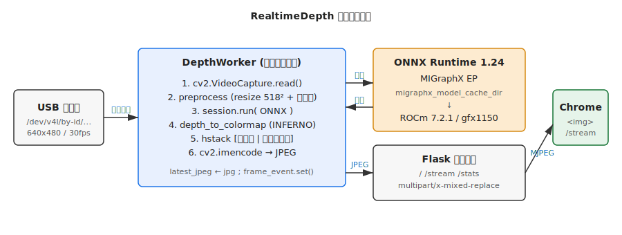
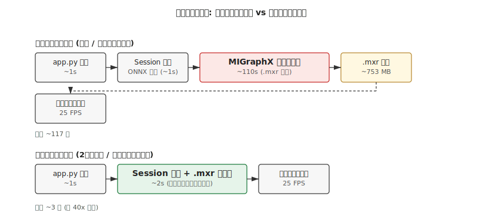
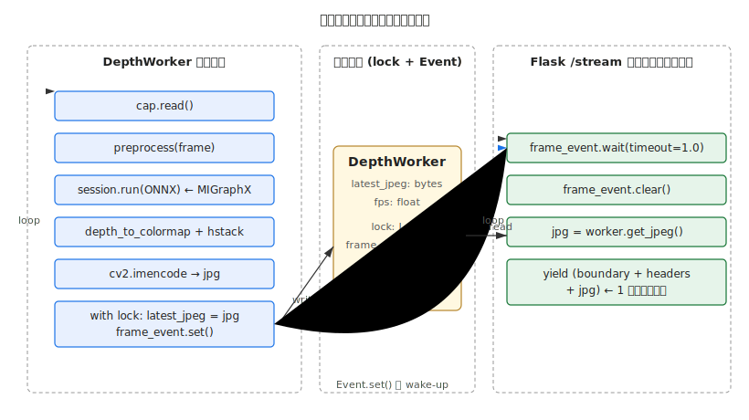

# RealtimeDepth — 技術解説

セットアップ手順は [READMEJ.md](./READMEJ.md) を参照。本書はアーキテクチャ、
設計判断、パフォーマンス特性、トラブルシュートを扱います。

---

## 1. システム概要



USB カメラから 30fps で取得したフレームを、`DepthWorker` という単一の背景
スレッドで「キャプチャ → 前処理 → 深度推論 → カラーマップ → JPEG エンコード」
まで一気通貫で処理し、`latest_jpeg` を共有変数にだけ書き込みます。
Flask の `/stream` エンドポイントは `multipart/x-mixed-replace` で
その JPEG を Chrome に流し続けます。

`DepthWorker` は **カメラ接続の管理** も担います。優先順位リストから
接続済みのカメラを自動選択し、USB の抜き差し (取り外し / 再接続 / 入れ替え)
にプロセスを落とさず追従し、未接続中はプレースホルダを配信する小さな
ステートマシンです。詳細は
[§5](#5-スレッド構成と同期) を参照。

主要コンポーネント:

| 層 | 採用技術 | 役割 |
| --- | --- | --- |
| カメラ I/O | OpenCV (V4L2 backend) | フレーム取得 |
| 推論 | ONNX Runtime 1.24 / MIGraphX EP | 単眼深度推定 |
| GPU runtime | ROCm 7.2.1 (gfx1151) | カーネル実行 |
| モデル | Depth Anything V2 Small (vits) | 約 24.8M params |
| 配信 | Flask + multipart/x-mixed-replace | MJPEG ストリーミング |

---

## 2. なぜ MIGraphX なのか — ROCm 7 における ONNX Runtime 事情

ROCm **7.1 以降は `ROCMExecutionProvider` が公式に廃止** され、AMD は
`MIGraphXExecutionProvider` への一本化を推進しています。PyPI で配布されて
いる `onnxruntime-rocm` は ROCm 6.x ビルドのため、ROCm 7.x では
`libhipblas.so.2` 等が見つからずプロバイダーのロード自体に失敗します
(ldd で確認可能)。

採用構成:

```
パッケージ : onnxruntime-migraphx (cp310 wheel)
配布元     : https://repo.radeon.com/rocm/manylinux/rocm-rel-7.2.1/
インストール: pip install -f <上記URL> onnxruntime-migraphx
provider   : ('MIGraphXExecutionProvider', {'device_id': 0, ...})
```

`pip install` には `--index-url` ではなく `-f` (find-links) を使います。
リポジトリは PEP 503 simple index ではなく単なるディレクトリ一覧のためです。

---

## 3. ONNX エクスポートの落とし穴 — `dynamo=False` 必須

PyTorch 2.9+ の `torch.onnx.export()` はデフォルトで dynamo (新 exporter)
を使います。これは内部的に opset 18 で書き出し、`Resize` 演算子に
`keep_aspect_ratio_policy` という新しい属性を付けます。

**MIGraphX 1.24.x はこの属性を未サポート**で、実行時に以下のエラーで落ちます:

```
PARSE_RESIZE: keep_aspect_ratio_policy is not supported!
[E:onnxruntime] Failed to call function
```

回避策: レガシー (TorchScript ベース) の exporter を明示的に使います。

```python
torch.onnx.export(
    ..., opset_version=17, dynamo=False,
)
```

これで Resize は opset 17 までの形式で書き出され、属性に
`keep_aspect_ratio_policy` は付かないため MIGraphX が正常にパースします。

---

## 4. MIGraphX コンパイルキャッシュ



MIGraphX は最初の `session.run()` で **AOT コンパイル** を行い、gfx1151 用の
HIP カーネルを生成します。Depth Anything V2 Small + 518² で **約 110 秒** か
かります。これを毎回行うと開発の反復が極端に遅くなるため、
`migraphx_model_cache_dir` プロバイダーオプションでコンパイル成果物
(`.mxr` ファイル、約 753 MB) を保存・再利用します。

```python
opts = {'device_id': 0,
        'migraphx_model_cache_dir': '/abs/path/.migraphx_cache'}
session = ort.InferenceSession(
    MODEL_PATH,
    providers=[('MIGraphXExecutionProvider', opts), 'CPUExecutionProvider'],
)
```

実測値:

| ケース | 起動時間 (app.py 開始 → /stats が応答) |
| --- | --- |
| コールド (`.mxr` 無し) | ~117 秒 (内 ~110 秒は MIGraphX コンパイル) |
| ウォーム (`.mxr` ヒット) | ~3 秒 |

キャッシュキーは ONNX のハッシュ + ORT バージョン + GPU アーキ等で決まる
ので、ONNX を作り直したり ROCm を更新した場合は `.migraphx_cache/` を
削除すれば自動的に再生成されます。

---

## 5. スレッド構成と同期



### 役割分担

- **`DepthWorker` スレッド**: ループでカメラから 1 フレーム取り、推論し、
  JPEG エンコードし、`latest_jpeg` に書き込む。1 周あたり ~40 ms (25 FPS)。
- **Flask /stream リクエストスレッド**: クライアント (Chrome) ごとに 1 本生成。
  `frame_event.wait()` で Worker からの通知を待ち、最新 JPEG を 1 個ずつ
  multipart 境界で送信する。

### 共有状態

```python
self.lock = threading.Lock()
self.frame_event = threading.Event()
self.latest_jpeg = None
self.fps = 0.0
self.current_name = None   # 配信中のカメラ名 (未接続時 None)
```

**最新 1 フレームのみ保持**する設計で、古いフレームは破棄します。
`Event` を使うことで、Worker が新フレームを書いた瞬間にだけ HTTP
スレッドを起こし、ビジーループによる帯域浪費を避けています。

### カメラ接続のステートマシン

同じ Worker ループがカメラのライフサイクルも管理するため、推論と接続状態を
1 スレッドが所有します (追加のロックは不要)。2 状態を遷移します:

```
[DISCONNECTED] --(登録カメラ検出 + open 成功)--> [STREAMING]
[STREAMING]    --(read 連続失敗 or デバイスパス消失)--> [DISCONNECTED]
```

- **DISCONNECTED**: 約 1 秒間隔で `find_connected_camera()` を呼びます。
  これは `camera.devices` を優先順位順にたどり、デバイスパスの存在を確認し、
  実際に open して 1 フレーム試し読みできるかで検証します。その間も
  「NO CAMERA」プレースホルダ JPEG を配信し続けるので、ブラウザの MJPEG
  接続は切れず、カメラを挿した瞬間に復帰します。よって **カメラ未接続でも
  アプリは起動します** (以前の `RuntimeError` は廃止)。
- **STREAMING**: 通常のキャプチャ → 推論 → エンコード。1 回の `cap.read()`
  失敗では切断とみなさず、連続失敗 (`READ_FAIL_LIMIT`, 約 10 回) または
  デバイスパスの消失 (`os.path.exists`) で初めて `cap.release()` して
  DISCONNECTED に戻ります。一部のカメラは切断後も `cap.read()` が
  ブロックし続けるため、両方の判定を併用しています。
- **同時に 1 台のみ**: 選択は優先順位順の先頭一致なので、登録済みカメラが
  複数同時に接続されていても最優先の 1 台だけを配信します。配信中の
  プリエンプションはしません — より優先度の高いカメラを途中で挿しても
  現在の映像は中断されません。切り替えたい場合は配信中のカメラを抜きます。

検出は依存追加を避けるためイベント駆動 (`pyudev`) ではなくポーリング
(パス存在 + read 失敗) ベースです。1 秒ポーリングは体感上問題ありません。

### 重要な歴史的バグ

初期実装の `mjpeg_generator` は `while True: yield latest_jpeg` の
ビジーループでした。同じフレームを毎ループ送り続けるため、
ローカルループバックで **3 秒で 9.3 GB** の異常な帯域消費が発生していました。
`Event.wait/clear` パターンに修正することで 1.5 MB/s (60 KB × 25 fps)
程度の妥当な値に落ち着いています。

---

## 6. 前処理と後処理

### 前処理 (`preprocess`)

Depth Anything V2 (DINOv2 バックボーン) は ImageNet 統計値で正規化した
RGB を期待します。

```python
rgb     = cv2.cvtColor(bgr, cv2.COLOR_BGR2RGB)
resized = cv2.resize(rgb, (518, 518), cv2.INTER_CUBIC)
normalized = (resized.astype(np.float32) / 255.0 - MEAN) / STD
return np.transpose(normalized, (2, 0, 1))[None, ...]
# MEAN = [0.485, 0.456, 0.406], STD = [0.229, 0.224, 0.225]
```

### 後処理 (`depth_to_colormap`)

DA V2 の出力は disparity 風で **近距離が大きい値** です。
シーンに対して安定した見た目になるよう、2/98 パーセンタイル
正規化 → `COLORMAP_INFERNO` を当てています。

- パーセンタイルクランプ: 太陽光等の異常値で全体が黒く潰れるのを防ぐ
- INFERNO: 黒 → 紫 → オレンジ → 黄 のグラデーション。視認性が高く、
  「明るい = 近い」直感に合う

---

## 7. 設定リファレンス (`config.yaml`)

```yaml
camera:
  devices:               # 優先順位順。最初に接続されているものが選ばれる
    - name: 2K USB Camera                 # ログ/画面表示/stats 用ラベル
      device: <int|str>  # 0 / "/dev/video0" / "/dev/v4l/by-id/usb-...-video-index0"
      width: 640         # デバイスごとに省略可。省略時は defaults を使用
      height: 480
      fps: 30
    - name: 予備カメラ
      device: <int|str>
  defaults:              # devices で width/height/fps を省略したときの既定値
    width: 640
    height: 480
    fps: 30

model:
  path: depth_anything_v2_vits_518.onnx
  input_size: 518        # ONNX export 時と一致させる

server:
  host: 0.0.0.0          # LAN 公開しないなら 127.0.0.1
  port: 8000
  jpeg_quality: 80       # 60-90 の範囲が実用的

runtime:
  compile_cache_dir: .migraphx_cache  # null にするとキャッシュ無効化
```

旧形式の単一指定 (トップレベルの `camera.device`/`width`/`height`/`fps`)
もそのまま受け付け、内部で 1 要素の `devices` リストに正規化するので、
既存の config はそのまま動きます。

`/stats` は選択中のカメラも返します:
`{"fps": 25.7, "camera": "2K USB Camera"}` (未接続時は `"camera": null`)。

`CONFIG_PATH=other.yaml ./start_all.sh` のように環境変数で別 config を
指定することも可能です (start_all.sh が config を読まない部分は影響します
が、`app.py` は `CONFIG_PATH` を尊重します)。

---

## 8. パフォーマンス調整

| 操作 | 効果 |
| --- | --- |
| `INPUT_SIZE` を 518 → 392 → 308 に下げる | 推論時間短縮 (要 ONNX 再 export) |
| `JPEG_QUALITY` を 80 → 60 に | LAN 帯域削減、デコード時間軽減 |
| FP16 化 (`onnxconverter_common.float16`) | 推論短縮 (要再キャッシュ) |
| 表示画像を `cv2.resize` で縮小 | エンコード時間短縮 |

なおこのプロジェクトの実測ボトルネックは **推論 ~30 ms / frame**。
カメラ I/O と JPEG エンコードは合計でも 5 ms 未満です。

---

## 9. 起動フロー (start_all.sh)

```
1. .depth_app.pid を確認 (多重起動防止)
2. .venv を activate, HSA_OVERRIDE_GFX_VERSION=11.5.1 を export
3. config.yaml から PORT を読む (yaml.safe_load via venv の python)
4. nohup python app.py > depth_app.log 2>&1 &
5. /stats を 3 秒間隔で curl し、HTTP 200 が返るまで最長 180 秒待つ
   - 判定基準は「fps > 0」ではなく「サーバー稼働」なので、カメラ未接続でも
     成功する (Worker はプレースホルダを配信)。Flask は MIGraphX コンパイル
     完了後にしか起動しないため、200 が返れば既にコンパイル済み
   - コールド時はこの間に MIGraphX が ~110 秒コンパイル
   - 「ready」行には選択中のカメラ名を表示 (未接続時はプレースホルダ配信中
     である旨を表示)
   - 失敗時はログ末尾を出して exit 1
6. LAN IP を `ip route get 1.1.1.1` から取得し URL を表示
7. DISPLAY/WAYLAND_DISPLAY があれば google-chrome で URL を開く
```

`stop_all.sh` は逆に PID ファイルから優しく `SIGTERM`、10 秒待って残れば
`SIGKILL`、最後に `pgrep -f "python app.py"` で残骸を回収します。

---

## 10. トラブルシューティング (詳細)

### `ROCMExecutionProvider` が出ない
本プロジェクトは MIGraphX を使うので **これは想定通り** です。
`MIGraphXExecutionProvider` がリストに入っていれば OK。

### MIGraphX のロードに失敗 (`libhipblas.so.2: cannot open shared object file`)
`onnxruntime-rocm` が PyPI から入っている可能性が高いです:
```bash
pip uninstall -y onnxruntime onnxruntime-rocm
pip install -f https://repo.radeon.com/rocm/manylinux/rocm-rel-7.2.1/ onnxruntime-migraphx
```

### `PARSE_RESIZE: keep_aspect_ratio_policy is not supported`
ONNX が新 exporter (dynamo=True) で書かれています。`dynamo=False` で
opset 17 として再エクスポートしてください ([§3](#3-onnx-エクスポートの落とし穴--dynamofalse-必須))。

### コンパイルが毎回走る
- `config.yaml` の `runtime.compile_cache_dir` がコメントアウトされていないか
- そのディレクトリが書き込み可能か (`ls -ld .migraphx_cache`)
- ONNX を作り直した直後は新キャッシュになる (1 回だけ ~110 秒)

### GPU が使われない / 推論が CPU 並みに遅い
- `session.get_providers()` の先頭が `MIGraphXExecutionProvider` か
- `HSA_OVERRIDE_GFX_VERSION=11.5.1` が export されているか (`start_all.sh`
  経由なら自動)
- 別ターミナルで `rocm-smi` を見て GPU 使用率が上がるか

### Chrome で映像が止まる
- 開発者ツール Network タブで `/stream` が `pending` のまま継続しているか
- 一度リロード (Cmd/Ctrl+R) で復帰
- 複数タブで同時に開くと無駄に Worker 帯域を食うので 1 タブ推奨

### カメラポート差し替え後に開けなくなった
`/dev/video*` のインデックスは USB ポートで変わります。
`config.yaml` の `camera.devices` の各エントリを `/dev/v4l/by-id/...` に
すれば、同じカメラならポートに依らず見つかります。`by-id` パスなら
抜き差し後の自動再接続も確実です (整数インデックスだと再接続時に別の
カメラを掴む可能性があります)。

### 「NO CAMERA」プレースホルダから変わらない
登録済みカメラが現在 1 台も接続されていません。`camera.devices` に列挙した
パスが存在するか (`ls /dev/v4l/by-id/`)、別プロセスが占有していないかを
確認してください。アプリは約 1 秒ごとにスキャンし、登録済みカメラが現れ
次第ライブ映像に切り替わります (再起動は不要)。

---

## 11. 今後の拡張余地

- **絶対距離化**: Depth Anything V2 Metric Depth 版 (Hypersim 学習) を使えば
  メートル値が得られる。HUD に「2.3 m」のように描画可能。
- **近接アラート**: 一定距離以内のピクセル数が閾値超ならフレーム枠を
  赤く描画。
- **WebSocket 化**: MJPEG → WS + binary で遅延をさらに詰める余地あり。
- **HTTPS 化**: LAN 外公開する場合は Tailscale + Caddy が手早い。
- **FP16 化**: `onnxconverter_common.float16` で半精度に変換、
  メモリ帯域削減効果あり (gfx1151 で約 1.3-1.5x の高速化が期待値)。

---

## 12. リポジトリ構成

```
RealtimeDepth/
├── app.py                  # Flask + DepthWorker (本体)
├── test_inference.py       # 推論単体テスト (~30 ms/frame 目安)
├── config.yaml             # ランタイム設定
├── start_all.sh            # 起動スクリプト (Chrome 自動起動)
├── stop_all.sh             # 停止スクリプト
├── READMEJ.md              # セットアップ手順書
├── TECHNICALJ.md           # 本書
├── docs/
│   ├── architecture.svg
│   ├── threading.svg
│   └── startup_sequence.svg
├── Depth-Anything-V2 -> ~/Depth-Anything-V2  (symlink)
├── depth_anything_v2_vits_518.onnx           (gitignore)
├── .migraphx_cache/                          (gitignore)
├── .depth_app.pid                            (gitignore)
└── depth_app.log                             (gitignore)
```
