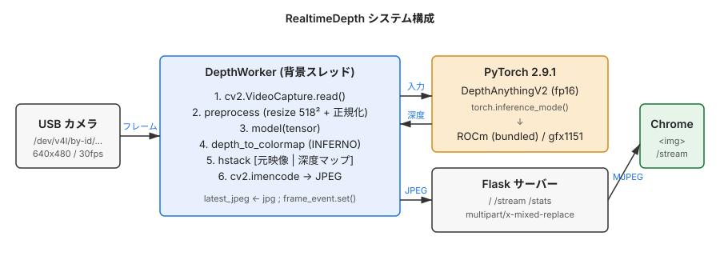
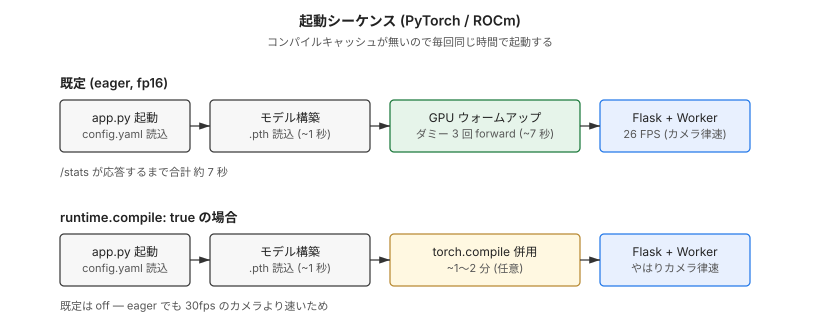
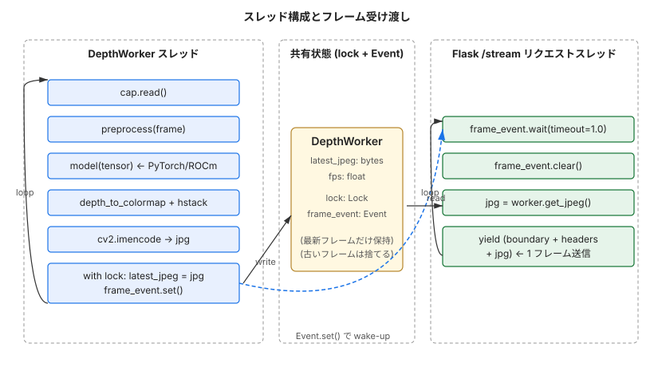

# RealtimeDepth — 技術解説

セットアップ手順は [READMEJ.md](./READMEJ.md) を参照。本書はアーキテクチャ、
設計判断、パフォーマンス特性、トラブルシュートを扱います。

---

## 1. システム概要



USB カメラから 30fps で取得したフレームを、`DepthWorker` という単一の背景
スレッドで「キャプチャ → 前処理 → 深度推論 → カラーマップ → JPEG エンコード」
まで一気通貫で処理し、`latest_jpeg` を共有変数にだけ書き込みます。
Flask の `/stream` エンドポイントは `multipart/x-mixed-replace` で
その JPEG を Chrome に流し続けます。

`DepthWorker` は **カメラ接続の管理** も担います。優先順位リストから
接続済みのカメラを自動選択し、USB の抜き差し (取り外し / 再接続 / 入れ替え)
にプロセスを落とさず追従し、未接続中はプレースホルダを配信する小さな
ステートマシンです。詳細は
[§5](#5-スレッド構成と同期) を参照。

主要コンポーネント:

| 層 | 採用技術 | 役割 |
| --- | --- | --- |
| カメラ I/O | OpenCV (V4L2 backend) | フレーム取得 |
| 推論 | PyTorch 2.9.1 (ROCm 7.13 wheel) | 単眼深度推定 |
| GPU runtime | wheel 同梱の ROCm (`rocm-sdk-libraries-gfx1151`) | カーネル実行 |
| モデル | Depth Anything V2 Small (vits) | 約 24.8M params |
| 配信 | Flask + multipart/x-mixed-replace | MJPEG ストリーミング |

---

## 2. なぜ PyTorch 直接推論なのか — ONNX/MIGraphX からの移行 (2026-07)

当初は ONNX Runtime + MIGraphX EP で推論していました。これを捨てて
PyTorch ネイティブ推論に移行しています。

### 移行の直接的なきっかけ

OS を Ubuntu 26.04 / ROCm 7.14 に上げた時点で、GPU 推論が復旧不能になりました。

1. **exec-stack**: venv の `onnxruntime_pybind11_state.so` が `GNU_STACK=RWE`
   (実行可能スタック) を要求し、26.04 のカーネルが import 時に拒否する。
   ELF の PF_X ビットを落とせば回避できるが、これで動くのは CPU 実行のみ。
2. **MIGraphX が存在しない**: gfx1151 / ROCm 7.14 向けの MIGraphX は AMD の
   どのチャネルにも配布されていません (`whl/gfx1151`・nightlies・
   `packages-multi-arch` を全確認済み)。唯一入手できる 7.2.1 汎用 deb は
   soname こそ 7.14 のライブラリで解決できるものの、**GPU カーネルの実行時
   JIT が 7.14 の clang/HIP ヘッダで失敗**します (`__hmax` の ambiguous、
   LLVM23 の `[[clang::lifetimebound]]` による -Werror、最終的に
   `std::bad_alloc`)。`-Wno-error` では回避できない本物のソース非互換です。

MIGraphX は GPU カーネルを **実行時にシステムの comgr/clang で JIT する**ため、
migraphx のバージョンと ROCm ツールチェインの版が揃っていないと動きません。
リンク ABI が一致しているだけでは不十分、というのがここでの教訓です。

### PyTorch を選んだ理由

- **DAv2 はもともと純 PyTorch モデル** (DINOv2 + DPT ヘッド)。ONNX という
  中間層自体が不要で、後述の Resize op 非互換のような罠も同時に消える。
- **システム ROCm からの構造的デカップリング**。PyTorch の ROCm wheel は
  依存として `rocm-sdk-libraries-gfx1151` を引き込み、**自前の ROCm ランタイムを
  同梱**します。動いていればよいのはカーネルドライバ (KFD/amdgpu、26.04 では
  in-tree で十分新しい) だけです。「ROCm 7.14 に MIGraphX が無い」問題は、
  onnxruntime-migraphx がシステム ROCm に密結合していたことが根本原因でした。
- **速い**。実測で ONNX Runtime の CPU フォールバック (約 10 FPS) の 8 倍近く
  出ています ([§8](#8-パフォーマンス)) 。

### 旧経路の遺産

いずれも削除済みです (2026-07): `.venv` (Python 3.10 +
onnxruntime-migraphx、CPU 実行のみ)、`depth_anything_v2_vits_518.onnx`、
`.migraphx_cache/` の `.mxr` — 合計約 2.2 GB。現行コードからの参照は
ゼロでした。

MIGraphX のソースビルドはリポジトリ外に、依存ライブラリのビルドまで完了した
状態で凍結してあります (`~/AMDMIGraphX`、詳細は `PROGRESS.md`)。推論単体で
77 FPS 出ている以上、戻る動機はありません。ONNX が再び必要になった場合は
`.pth` から export し直してください。

---

## 3. wheel 入手先の落とし穴

PyTorch 経路の失敗のほぼ全てが、この 3 点のどれかです。

### 3-1. gfx1151 専用 index を使うこと

```
https://repo.amd.com/rocm/whl/gfx1151/     ← これ
https://download.pytorch.org/whl/rocm...   ← 使わない
```

pytorch.org の ROCm wheel はマルチアーキの kpack ビルドで、gfx1151 では
バンドルされた code object をロードできず実行時に落ちます:

```
hipErrorInvalidImage
kpack_load_code_object failed with error: 13
```

インストール例は [READMEJ.md §3](./READMEJ.md) を参照。

### 3-2. torch と torchvision はバージョン組で固定すること

index には torchvision 0.24.0 / 0.25.0 / 0.26.0 が横並びで置かれており、
バージョン指定を省くと最新が入って torch と食い違います。その場合
import 時にこう落ちます:

```
RuntimeError: operator torchvision::nms does not exist
```

torchvision の C++ 拡張が別バージョンの libtorch に対してビルドされており、
カスタム op の登録が済まないまま `register_fake` が走るためです。

| torch | torchvision |
| --- | --- |
| 2.9.1 | 0.24.0 |
| 2.10.0 | 0.25.0 |
| 2.11.0 | 0.26.0 |

torchvision は省略できません。`depth_anything_v2/dpt.py` が
`from torchvision.transforms import Compose` を import しています
(実際に使うのは公式の `infer_image()` 経路だけですが、import は無条件に走ります)。

### 3-3. `HSA_OVERRIDE_GFX_VERSION` を設定しないこと

`repo.amd.com/rocm/whl/gfx1151/` の wheel は gfx1151 ネイティブビルドです。
gfx1100 等に見せかける override は不要どころか有害なので、`start_all.sh` は
シェルプロファイル由来の値に備えて明示的に `unset` しています。

> 旧 MIGraphX 経路では `HSA_OVERRIDE_GFX_VERSION=11.5.1` が必要でした。
> 古い手順書をコピーしてこれを export すると壊れます。

### 3-4. Python バージョン

gfx1151 の wheel は **cp312 / cp313 / cp314** のみです。旧 `.venv` は
Python 3.10 (onnxruntime-migraphx の cp310 wheel に合わせたもの) なので
再利用できず、`.venv-torch` を新規に作っています。

---

## 4. モデルのロードとウォームアップ



`app.py` は起動時に公式リポジトリの `depth_anything_v2` パッケージを
`sys.path` 経由で import し、encoder に応じた DPT ヘッド構成でモデルを
組み立てて `.pth` を読み込みます。

```python
sys.path.insert(0, DAV2_REPO)            # config の model.repo (symlink)
from depth_anything_v2.dpt import DepthAnythingV2

ENCODER_CONFIGS = {                      # 公式 app.py の model_configs と同一
    'vits': {'features': 64,  'out_channels': [48, 96, 192, 384]},
    'vitb': {'features': 128, 'out_channels': [96, 192, 384, 768]},
    'vitl': {'features': 256, 'out_channels': [256, 512, 1024, 1024]},
    'vitg': {'features': 384, 'out_channels': [1536, 1536, 1536, 1536]},
}
model = DepthAnythingV2(encoder=ENCODER, **ENCODER_CONFIGS[ENCODER])
model.load_state_dict(torch.load(CHECKPOINT, map_location='cpu'))
model = model.to(device=DEVICE, dtype=DTYPE).eval()
```

`input_size` は **14 の倍数**でなければなりません。DPT ヘッドが入力を
14×14 のパッチに分割するためで、既定の 518 は `14 × 37` です。不正値は
起動時に `ValueError` で弾きます。

### ウォームアップ

初回の `forward()` では HIP カーネルの JIT、MIOpen の畳み込みアルゴリズム
選択、アロケータのプール確保が同時に走り、数秒かかります。これを Flask 起動
**前**に済ませておかないと、最初の数フレームだけ極端に遅い FPS が表示されます。

```python
def warmup():
    dummy = np.zeros((INPUT_SIZE, INPUT_SIZE, 3), dtype=np.uint8)
    for _ in range(3):
        infer(dummy)
    torch.cuda.synchronize()
```

| ケース | 起動時間 (app.py 開始 → /stats が応答) |
| --- | --- |
| 既定 (eager, fp16) | 約 7 秒 (うちウォームアップ約 7 秒) |
| `runtime.compile: true` | 1〜2 分 (torch.compile のコンパイル) |

旧 MIGraphX 経路の ~110 秒の AOT コンパイルと 753 MB の `.mxr` キャッシュは
不要になりました。`.migraphx_cache/` は削除済みです。

### torch.compile

`runtime.compile: true` で `torch.compile(model, mode="reduce-overhead")` を
有効にできます。既定は off です — fp16 eager で既に 77 FPS 出ており、
ボトルネックはカメラの 30fps 側にあるため、起動のたびに 1〜2 分払う価値が
ありません。より大きな encoder や高解像度に切り替えたときの選択肢として
残してあります。

---

## 5. スレッド構成と同期



### 役割分担

- **`DepthWorker` スレッド**: ループでカメラから 1 フレーム取り、推論し、
  JPEG エンコードし、`latest_jpeg` に書き込む。1 周あたり ~38 ms (26 FPS)。
  推論自体は ~13 ms なので、この周期はカメラの 30fps に律速されています。
- **Flask /stream リクエストスレッド**: クライアント (Chrome) ごとに 1 本生成。
  `frame_event.wait()` で Worker からの通知を待ち、最新 JPEG を 1 個ずつ
  multipart 境界で送信する。

### 共有状態

```python
self.lock = threading.Lock()
self.frame_event = threading.Event()
self.latest_jpeg = None
self.fps = 0.0
self.current_name = None   # 配信中のカメラ名 (未接続時 None)
```

**最新 1 フレームのみ保持**する設計で、古いフレームは破棄します。
`Event` を使うことで、Worker が新フレームを書いた瞬間にだけ HTTP
スレッドを起こし、ビジーループによる帯域浪費を避けています。

### カメラ接続のステートマシン

同じ Worker ループがカメラのライフサイクルも管理するため、推論と接続状態を
1 スレッドが所有します (追加のロックは不要)。2 状態を遷移します:

```
[DISCONNECTED] --(登録カメラ検出 + open 成功)--> [STREAMING]
[STREAMING]    --(read 連続失敗 or デバイスパス消失)--> [DISCONNECTED]
```

- **DISCONNECTED**: 約 1 秒間隔で `find_connected_camera()` を呼びます。
  これは `camera.devices` を優先順位順にたどり、デバイスパスの存在を確認し、
  実際に open して 1 フレーム試し読みできるかで検証します。その間も
  「NO CAMERA」プレースホルダ JPEG を配信し続けるので、ブラウザの MJPEG
  接続は切れず、カメラを挿した瞬間に復帰します。よって **カメラ未接続でも
  アプリは起動します** (以前の `RuntimeError` は廃止)。
- **STREAMING**: 通常のキャプチャ → 推論 → エンコード。1 回の `cap.read()`
  失敗では切断とみなさず、連続失敗 (`READ_FAIL_LIMIT`, 約 10 回) または
  デバイスパスの消失 (`os.path.exists`) で初めて `cap.release()` して
  DISCONNECTED に戻ります。一部のカメラは切断後も `cap.read()` が
  ブロックし続けるため、両方の判定を併用しています。
- **同時に 1 台のみ**: 選択は優先順位順の先頭一致なので、登録済みカメラが
  複数同時に接続されていても最優先の 1 台だけを配信します。配信中の
  プリエンプションはしません — より優先度の高いカメラを途中で挿しても
  現在の映像は中断されません。切り替えたい場合は配信中のカメラを抜きます。

検出は依存追加を避けるためイベント駆動 (`pyudev`) ではなくポーリング
(パス存在 + read 失敗) ベースです。1 秒ポーリングは体感上問題ありません。

### 重要な歴史的バグ

初期実装の `mjpeg_generator` は `while True: yield latest_jpeg` の
ビジーループでした。同じフレームを毎ループ送り続けるため、
ローカルループバックで **3 秒で 9.3 GB** の異常な帯域消費が発生していました。
`Event.wait/clear` パターンに修正することで 1.5 MB/s (60 KB × 25 fps)
程度の妥当な値に落ち着いています。

---

## 6. 前処理と後処理

### 前処理 (`preprocess`)

Depth Anything V2 (DINOv2 バックボーン) は ImageNet 統計値で正規化した
RGB を期待します。リサイズまでは CPU (OpenCV) で行い、**正規化は GPU 側**で
やります。

```python
rgb     = cv2.cvtColor(bgr, cv2.COLOR_BGR2RGB)
resized = cv2.resize(rgb, (518, 518), interpolation=cv2.INTER_CUBIC)
t = torch.from_numpy(np.ascontiguousarray(resized)).to(DEVICE)   # uint8 HWC のまま転送
t = t.permute(2, 0, 1).unsqueeze(0).to(DTYPE).div_(255.0)        # GPU 上で CHW / fp16 化
return (t - MEAN) / STD
# MEAN = [0.485, 0.456, 0.406], STD = [0.229, 0.224, 0.225] (fp16, shape (1,3,1,1))
```

CPU 側で float32 に展開してから転送すると 518×518×3×4 = 約 3.2 MB に
なりますが、uint8 のまま送れば 1/4 の約 0.8 MB で済みます。正規化そのものは
GPU では実質ゼロコストです。

### 推論 (`infer`)

```python
@torch.inference_mode()
def infer(bgr):
    depth = model(preprocess(bgr))   # forward は (B, H, W) を返す
    return depth[0].float().cpu().numpy()
```

`DepthAnythingV2.forward()` は末尾で `squeeze(1)` するため、出力はチャネル
次元のない `(B, H, W)` です (ONNX 経路の `out[0][0]` と同じものを指します)。
fp16 で推論しているので、`depth_to_colormap` に渡す前に `.float()` します。

### 後処理 (`depth_to_colormap`)

DA V2 の出力は disparity 風で **近距離が大きい値** です。
シーンに対して安定した見た目になるよう、2/98 パーセンタイル
正規化 → `COLORMAP_INFERNO` を当てています。

- パーセンタイルクランプ: 太陽光等の異常値で全体が黒く潰れるのを防ぐ
- INFERNO: 黒 → 紫 → オレンジ → 黄 のグラデーション。視認性が高く、
  「明るい = 近い」直感に合う

---

## 7. 設定リファレンス (`config.yaml`)

```yaml
camera:
  devices:               # 優先順位順。最初に接続されているものが選ばれる
    - name: 2K USB Camera                 # ログ/画面表示/stats 用ラベル
      device: <int|str>  # 0 / "/dev/video0" / "/dev/v4l/by-id/usb-...-video-index0"
      width: 640         # デバイスごとに省略可。省略時は defaults を使用
      height: 480
      fps: 30
    - name: 予備カメラ
      device: <int|str>
  defaults:              # devices で width/height/fps を省略したときの既定値
    width: 640
    height: 480
    fps: 30

model:
  repo: Depth-Anything-V2   # 公式リポジトリ (symlink 可)。sys.path に追加される
  encoder: vits             # vits / vitb / vitl / vitg
  checkpoint: Depth-Anything-V2/checkpoints/depth_anything_v2_vits.pth
  input_size: 518           # 14 の倍数であること (518 = 14 x 37)

server:
  host: 0.0.0.0          # LAN 公開しないなら 127.0.0.1
  port: 8000
  jpeg_quality: 80       # 60-90 の範囲が実用的

runtime:
  device: cuda           # ROCm の HIP 層が CUDA API を受ける。CPU 実行なら "cpu"
  precision: fp16        # fp16 / fp32
  compile: false         # torch.compile(mode="reduce-overhead")
```

`model.repo` / `model.checkpoint` は `config.yaml` からの相対パスとして
解決されます。encoder を変える場合は `encoder` と `checkpoint` の両方を
揃えてください (組み合わせが食い違うと `load_state_dict` が shape mismatch で
落ちます)。

旧形式の単一指定 (トップレベルの `camera.device`/`width`/`height`/`fps`)
もそのまま受け付け、内部で 1 要素の `devices` リストに正規化するので、
既存の config はそのまま動きます。

`/stats` は選択中のカメラも返します:
`{"fps": 25.7, "camera": "2K USB Camera"}` (未接続時は `"camera": null`)。

`CONFIG_PATH=other.yaml ./start_all.sh` のように環境変数で別 config を
指定することも可能です (start_all.sh が config を読まない部分は影響します
が、`app.py` は `CONFIG_PATH` を尊重します)。

### 新規カメラの登録手順

1. カメラを接続した状態で `by-id` の固定パスを確認する:

   ```bash
   ls -l /dev/v4l/by-id/
   ```

   USB インデックス (`/dev/video*`) は挿し直すと変動するので、ポートに
   依存しない `by-id` パスを使うのが推奨です。capture ストリームは
   `-video-index0` で終わるもので、`-video-index1` 以降はメタデータ用なので
   選ばないでください。

2. `config.yaml` の `camera.devices` にエントリを 1 つ追記する:

   ```yaml
   camera:
     devices:
       - name: ELECOM 2MP Webcam               # ログ/画面表示/stats 用の任意ラベル
         device: /dev/v4l/by-id/usb-Alcor_Micro__Corp._ELECOM_2MP_Webcam-video-index0
   ```

   `width`/`height`/`fps` を省略すると `defaults` が適用されます。
   リストの上にあるものほど優先され、複数同時接続時は最初に見つかった
   1 台だけが配信されます。

3. サーバーを再起動して反映する:

   ```bash
   ./stop_all.sh && ./start_all.sh
   ```

   起動後、ログに `[camera] connected: <name> (...)` が出れば配信開始です。
   USB ホットプラグに対応しているので、起動後に挿しても約 1 秒以内に
   自動検出されます。

---

## 8. パフォーマンス

### 実測値 (Radeon 8060S / gfx1151 / vits / 518² / fp16)

| 項目 | 値 |
| --- | --- |
| 推論単体 (`test_inference.py`) | **12.5 ms / frame (79.9 FPS)** |
| アプリ全体 (取得+推論+カラーマップ+JPEG) | **26 FPS** |
| 起動時間 (モデルロード + ウォームアップ) | 約 7 秒 |
| 参考: 旧 ONNX Runtime **CPU** フォールバック | 約 10 FPS |

**現在のボトルネックはカメラ側**です。推論に 13 ms しかかからないのに対し、
カメラは 30fps (33 ms/frame) でしか出さないため、パイプライン全体は
カメラの供給レートに張り付いています。推論を速くしても表示 FPS は
上がりません。

### 調整の効き方

| 操作 | 効果 |
| --- | --- |
| `camera.devices[].fps` を上げる (カメラが対応していれば) | **表示 FPS が上がる唯一の手段** |
| `runtime.precision` を `fp16` → `fp32` | 推論が約 2 倍遅くなる。精度差はこの用途では体感できない |
| `model.encoder` を `vits` → `vitb` / `vitl` | 精度向上と引き換えに推論時間増。vits で余裕があるので選択肢になる |
| `model.input_size` を 518 → 392 → 280 に下げる | 推論時間短縮 (14 の倍数のこと)。再エクスポート不要 |
| `runtime.compile: true` | eager 比で数割高速化。起動に 1〜2 分上乗せ |
| `server.jpeg_quality` を 80 → 60 に | LAN 帯域削減、デコード時間軽減 |

ONNX 経路では入力サイズや精度を変えるたびに再 export + 再コンパイル
(~110 秒) が必要でしたが、PyTorch 直では `config.yaml` を書き換えて
再起動するだけです。

---

## 9. 起動フロー (start_all.sh)

```
1. .depth_app.pid を確認 (多重起動防止)
2. .venv-torch を activate, HSA_OVERRIDE_GFX_VERSION を unset
3. config.yaml から PORT を読む (yaml.safe_load via venv の python)
4. nohup python app.py > depth_app.log 2>&1 &
5. /stats を 3 秒間隔で curl し、HTTP 200 が返るまで最長 180 秒待つ
   - 判定基準は「fps > 0」ではなく「サーバー稼働」なので、カメラ未接続でも
     成功する (Worker はプレースホルダを配信)。Flask はモデルロードと
     ウォームアップの完了後にしか起動しないため、200 が返れば推論は準備済み
   - 既定 (eager) ではこの間は約 7 秒。torch.compile 有効時は 1〜2 分
   - 「ready」行には選択中のカメラ名を表示 (未接続時はプレースホルダ配信中
     である旨を表示)
   - 失敗時はログ末尾を出して exit 1
6. LAN IP を `ip route get 1.1.1.1` から取得し URL を表示
7. DISPLAY/WAYLAND_DISPLAY があれば google-chrome で URL を開く
```

`stop_all.sh` は逆に PID ファイルから優しく `SIGTERM`、10 秒待って残れば
`SIGKILL`、最後に `pgrep -f "python app.py"` で残骸を回収します。

---

## 10. トラブルシューティング (詳細)

### `hipErrorInvalidImage` / `kpack_load_code_object failed with error: 13`
wheel が gfx1151 用ではありません。`download.pytorch.org` のマルチアーキ
wheel を入れてしまった典型例です ([§3-1](#3-1-gfx1151-専用-index-を使うこと))。
`repo.amd.com/rocm/whl/gfx1151/` から入れ直してください。

```bash
VIRTUAL_ENV=$PWD/.venv-torch uv pip install --reinstall \
  --index-url https://repo.amd.com/rocm/whl/gfx1151/ \
  --extra-index-url https://pypi.org/simple \
  --index-strategy unsafe-best-match --prerelease allow \
  torch==2.9.1+rocm7.13.0 torchvision==0.24.0+rocm7.13.0
```

### `RuntimeError: operator torchvision::nms does not exist`
torch と torchvision のバージョンが噛み合っていません
([§3-2](#3-2-torch-と-torchvision-はバージョン組で固定すること))。
組で固定して入れ直してください。

### `ValueError: model.input_size は 14 の倍数である必要があります`
DPT ヘッドの制約です。518 / 392 / 280 など 14 で割り切れる値にしてください。

### `load_state_dict` が size mismatch で落ちる
`model.encoder` と `model.checkpoint` の組み合わせが食い違っています。
`vits` なら `depth_anything_v2_vits.pth`、`vitl` なら
`depth_anything_v2_vitl.pth` というように両方を揃えてください。

### `torch.cuda.is_available()` が False
- `ls /dev/kfd /dev/dri` が通るか (通らなければカーネル側の問題)
- ユーザーが `render` / `video` グループに入っているか (`id`)
- **`HSA_OVERRIDE_GFX_VERSION` が export されていないか** — 設定されていると
  gfx1151 ネイティブ wheel が壊れます ([§3-3](#3-3-hsa_override_gfx_version-を設定しないこと))
- `python -c "import torch; print(torch.version.hip)"` で HIP ビルドか確認

### GPU が使われない / 推論が遅い
- `runtime.precision` が `fp32` になっていないか (fp16 の約 2 倍遅い)
- `runtime.device` が `cpu` になっていないか
- `.venv-torch/bin/python test_inference.py` で推論単体を切り分ける
  (fp16 vits 518² で約 12 ms / 78 FPS が目安)
- 別ターミナルで `rocm-smi` を見て GPU 使用率が上がるか
- 表示 FPS が 26〜30 で頭打ちなのは**正常**です (カメラの 30fps 律速、
  [§8](#8-パフォーマンス))

### 起動ログの警告について
以下は無害で、動作に影響しません:
- `xFormers not available` — DINOv2 が xformers を optional import しているだけ
- `warning: xnack 'Off' was requested for a processor that does not support it!`
- `MIOpen(HIP): Warning [ParseAndLoadDb] File is unreadable: ...gfx1151_20.HIP.fdb.txt`
  — MIOpen の事前チューニング DB が同梱されていないだけ。畳み込みアルゴリズムは
  初回実行時に自動選択され、結果はユーザーキャッシュに保存されます

### Chrome で映像が止まる
- 開発者ツール Network タブで `/stream` が `pending` のまま継続しているか
- 一度リロード (Cmd/Ctrl+R) で復帰
- 複数タブで同時に開くと無駄に Worker 帯域を食うので 1 タブ推奨

### カメラポート差し替え後に開けなくなった
`/dev/video*` のインデックスは USB ポートで変わります。
`config.yaml` の `camera.devices` の各エントリを `/dev/v4l/by-id/...` に
すれば、同じカメラならポートに依らず見つかります。`by-id` パスなら
抜き差し後の自動再接続も確実です (整数インデックスだと再接続時に別の
カメラを掴む可能性があります)。

### 「NO CAMERA」プレースホルダから変わらない
登録済みカメラが現在 1 台も接続されていません。`camera.devices` に列挙した
パスが存在するか (`ls /dev/v4l/by-id/`)、別プロセスが占有していないかを
確認してください。アプリは約 1 秒ごとにスキャンし、登録済みカメラが現れ
次第ライブ映像に切り替わります (再起動は不要)。

---

## 11. 今後の拡張余地

- **絶対距離化**: Depth Anything V2 Metric Depth 版 (Hypersim 学習) を使えば
  メートル値が得られる。HUD に「2.3 m」のように描画可能。
- **近接アラート**: 一定距離以内のピクセル数が閾値超ならフレーム枠を
  赤く描画。
- **WebSocket 化**: MJPEG → WS + binary で遅延をさらに詰める余地あり。
- **HTTPS 化**: LAN 外公開する場合は Tailscale + Caddy が手早い。
- **余った GPU 余力の活用**: 推論に 13 ms しか使っておらずカメラ律速なので、
  より大きな encoder (`vitb` / `vitl`) や高解像度カメラに振っても
  リアルタイム域を維持できる見込み。
- **`torch.compile` の常用**: 上記でモデルを重くした場合に
  `runtime.compile: true` が効いてくる。起動 1〜2 分とのトレードオフ。

> FP16 化は既に実装済みです (`runtime.precision: fp16` が既定)。

---

## 12. リポジトリ構成

```
RealtimeDepth/
├── app.py                  # Flask + DepthWorker (本体)
├── test_inference.py       # 推論単体ベンチ (~12.5 ms/frame 目安)
├── config.yaml             # ランタイム設定
├── start_all.sh            # 起動スクリプト (Chrome 自動起動)
├── stop_all.sh             # 停止スクリプト
├── READMEJ.md              # セットアップ手順書
├── TECHNICALJ.md           # 本書
├── PROGRESS.md             # ROCm 7.14 対応の作業記録 (MIGraphX → PyTorch)
├── docs/
│   ├── architecture.svg
│   ├── threading.svg
│   └── startup_sequence.svg
├── Depth-Anything-V2 -> <各自のクローン先>  (自分で作る symlink; gitignore)
│                            # 公式リポジトリ。checkpoints/*.pth を含む
├── .venv-torch/            # PyTorch (ROCm) 実行環境 (gitignore)
├── .depth_app.pid                            (gitignore)
└── depth_app.log                             (gitignore)
```

---

## 13. 変更履歴

- **PyTorch (ROCm) 直接推論へ移行 (2026-07)**: ONNX Runtime + MIGraphX を廃止し、
  `depth_anything_v2` パッケージを直接 import して `.pth` から推論する構成に変更。
  Ubuntu 26.04 / ROCm 7.14 で GPU 実行が復活し、推論単体 12.5 ms/frame (79.9 FPS)。
  venv は `.venv-torch` (Python 3.14)、wheel は `repo.amd.com/rocm/whl/gfx1151/`、
  `HSA_OVERRIDE_GFX_VERSION` は不要に。経緯は §2〜§4 と `PROGRESS.md` を参照。
- **複数カメラ / USB ホットプラグ対応**: `camera.devices` の優先順位リストと
  自動再接続を導入。旧形式の単一カメラ指定も後方互換で受け付ける。
- **接続カメラの登録**: ELECOM 2MP Webcam を `by-id` 固定パスで登録。
  新規カメラの追加手順は §7 を参照。
- **起動メッセージ修正**: `/stats` 応答から DepthWorker がカメラを開くまでの
  数百 ms のタイムラグで「no camera connected」と誤表示していた問題を修正。
  `start_all.sh` がカメラ名の確定を数秒待ってから判定するようにした。
